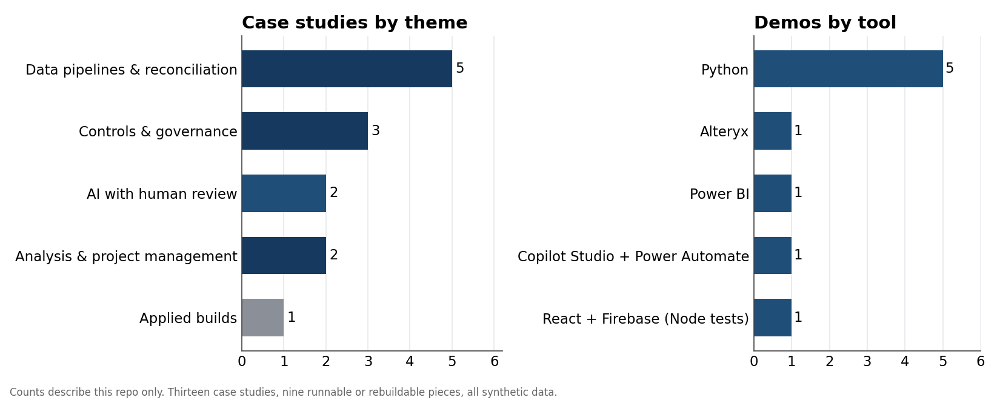
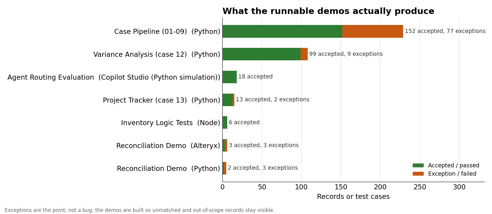
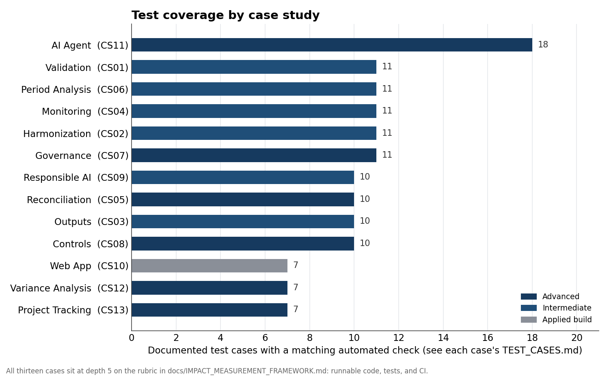

# Automation & Analytics Portfolio

[](https://github.com/Erkzucr/automation-analytics-portfolio/actions/workflows/python-tests.yml)

Thirteen case studies on reconciliation, controls, automation, analysis and AI in finance work, each with code that runs and tests that check it. Everything except case 10 uses synthetic data: no production files, no internal process names, nothing traceable to an employer. The problems are ones I've dealt with; the numbers, codes, SOPs and thresholds were made up for this repo. Case 10 is a real app built for a school, published without its Firebase config or the school's data.

**[If you're reviewing this for a role](RECRUITER_START_HERE.md)** · [Versión en español](README_ES.md) · [One-page PDF](assets/Erick_Zuniga_Automation_Analytics_Portfolio_OnePager.pdf) · [LinkedIn](https://www.linkedin.com/in/erick-zuniga-finance)



## What's in here

Cases 01 to 09 cover the recurring problems in reconciliation and controls: sources that don't agree, exceptions that need an owner, a flux that needs a written threshold, evidence an auditor can follow, and AI used as a drafting tool with a person signing off. Case 11 is a Copilot Studio agent for finance policy questions with no ability to act on the ledger. Case 12 splits people cost variance into headcount, rate, mix and one-offs. Case 13 tracks a close improvement project with earned value and generates its status report. Case 10 is the school inventory app.

Each case has a write-up, a diagram, sample data with a dictionary, test cases, a control matrix, and code that produces the expected output. The tests run in GitHub Actions on every push.

```
# Shared pipeline behind cases 01 to 09: regenerates every expected-output and compares it
cd demo/case-pipeline
python run_case.py all --check
python -m unittest discover -s tests -v

# Standalone reconciliation demo
cd demo/python-reconciliation-demo
python run_demo.py

# Agent routing evaluation, variance analysis, project tracker
cd case-studies/11-copilot-studio-finance-agent/evaluation && python evaluate_agent.py
cd case-studies/12-people-cost-variance-analysis/analysis && python variance_analysis.py
cd case-studies/13-close-improvement-project-tracker/tracker && python project_tracker.py

# School inventory app logic, no React or Firebase needed
cd case-studies/10-school-inventory-webapp
node --test tests/*.test.js
```

An Alteryx workflow is at `demo/alteryx-reconciliation-demo/Synthetic_Reconciliation_Demo.yxmd`. It reads only the synthetic files next to it.



## Case studies

| # | Case | What it shows |
|---|---|---|
| 01 | [Periodic Estimate Analysis](case-studies/01-periodic-estimate-analysis/README.md) | Validating an estimate against a reference and a ceiling |
| 02 | [Multi-Source Data Harmonization](case-studies/02-multi-source-harmonization/README.md) | Two sources, one schema, a versioned map |
| 03 | [Balanced Output Preparation](case-studies/03-balanced-output-preparation/README.md) | Summaries that don't publish unless they tie |
| 04 | [Exception Monitoring and Prioritization](case-studies/04-exception-monitoring/README.md) | What a reviewer sees first |
| 05 | [Source-to-Record Reconciliation](case-studies/05-source-to-record-reconciliation/README.md) | Full outer match so unmatched rows stay visible |
| 06 | [Period-Over-Period Analysis](case-studies/06-period-over-period-analysis/README.md) | Flux check with a written threshold |
| 07 | [Policy-Driven Calculation Governance](case-studies/07-policy-driven-calculation-governance/README.md) | Rates in one versioned file; missing policy is an exception |
| 08 | [Control Evidence and Assurance Lifecycle](case-studies/08-control-evidence-lifecycle/README.md) | Evidence a reviewer can find later |
| 09 | [AI-Assisted Knowledge Capture](case-studies/09-ai-assisted-knowledge-capture/README.md) | AI drafts, a person verifies |
| 10 | [School Inventory Web App](case-studies/10-school-inventory-webapp/README.md) | A real React app with its logic under test |
| 11 | [Copilot Studio Finance Agent](case-studies/11-copilot-studio-finance-agent/README.md) | Read-only agent grounded in SOPs, with a test set in CI |
| 12 | [People Cost Variance Analysis](case-studies/12-people-cost-variance-analysis/README.md) | Headcount, rate, mix and one-offs; materiality by amount and percent; KPIs and a bridge |
| 13 | [Close Improvement Project Tracker](case-studies/13-close-improvement-project-tracker/README.md) | Earned value, milestones, scored risks, generated status report |

Cases 01 to 09 share one pipeline in [`demo/case-pipeline`](demo/case-pipeline/README.md). Each has a `case.json` naming its logic block and parameters. The sample data includes a missing field, a duplicate key, an unmapped reference and an amount with a letter in it, so the documented test cases are exercised rather than described.

A [3-page Power BI dashboard](demo/power-bi-portfolio-dashboard/README.md) on the portfolio's own metadata is in `demo/`, with the data, DAX measures and layout spec to rebuild it.



Each case is scored against a written [rubric](docs/IMPACT_MEASUREMENT_FRAMEWORK.md). Depth 5 requires runnable code, tests and CI. All thirteen meet it, and the badge at the top is the check.

## How the work is approached

Standardize first, then automate, with controls designed in from the start and a named owner after go-live. The tools have been Alteryx, Power Query, VBA, Python, Power Automate and Copilot Studio, depending on the piece. The order hasn't changed with the tool.

For the AI cases (09 and 11): the model drafts or explains, a person decides, and what the tool can touch is set in configuration rather than in a prompt. The [decision notes](docs/decisions/) cover the reasoning.

## Data

The CSVs, the numbers, the "companies", the SOPs and the project plan were all created for this repo. Nothing comes from a production system or an employer's process.
