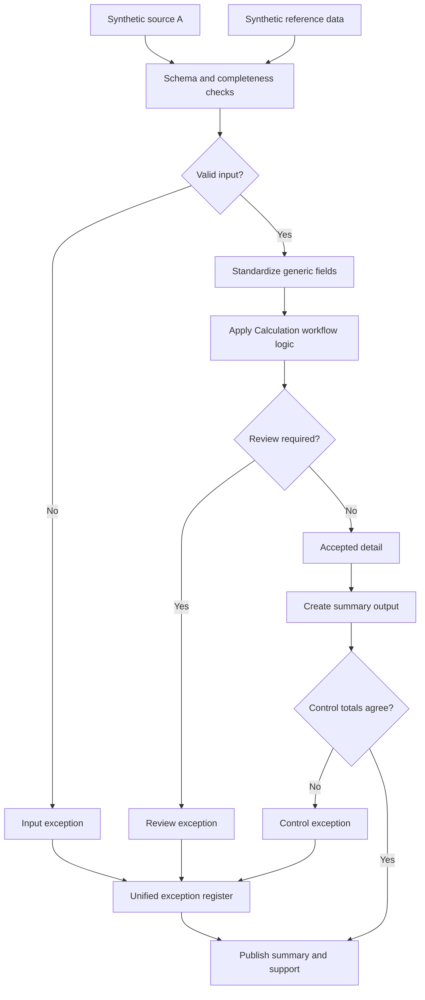

# Periodic Estimate Analysis

Every close cycle has some kind of recurring estimate that gets rebuilt from scratch each period, usually from two or three files that don't quite agree on formatting. I built this case study to show how I'd turn that into a controlled, repeatable workflow instead of a spreadsheet someone rebuilds by hand every month.

## What this really solves

Every closing period, someone has to rebuild a recurring estimate from two or three files that never quite agree. When those files drift — a renamed field, a missing row, a typo in a status code — the mistake usually isn't caught until someone's already working off the wrong number.

## Business impact

This catches bad data before it becomes a bad number. Leadership gets an estimate they can trust without double-checking it every month, and the process doesn't depend on one specific person remembering to look closely.

## How it works

The workflow validates schema and completeness before anything else runs, standardizes the fields it needs, applies the calculation logic, and then splits the results into two buckets: accepted records and records that need a human to look at them. Nothing gets silently dropped. Everything that doesn't pass validation lands in an exception register with enough context to explain why.

## Steps

1. Load the source and reference data.
2. Check schema, required fields, and duplicate keys.
3. Standardize identifiers, dates, statuses, and values so downstream logic isn't guessing at formats.
4. Run the calculation logic.
5. Split accepted records from exceptions.
6. Build the summary and supporting detail.
7. Tie the summary back to the accepted detail before publishing anything.

## Controls

- Required fields and duplicate keys get caught before they touch the calculation
- Reference data is checked for completeness, not just existence
- Input counts reconcile to accepted-plus-exception counts, so nothing silently disappears
- Summary output ties to detail before it goes out the door
- Every exception, regardless of source, lands in one register instead of three different places

Skills this exercises: workflow design, data validation, exception handling, control design, and writing it up in a way a reviewer could actually follow.

The data here is fully synthetic, generated for this repository. There's no real employer process, dataset, or proprietary logic behind it.
