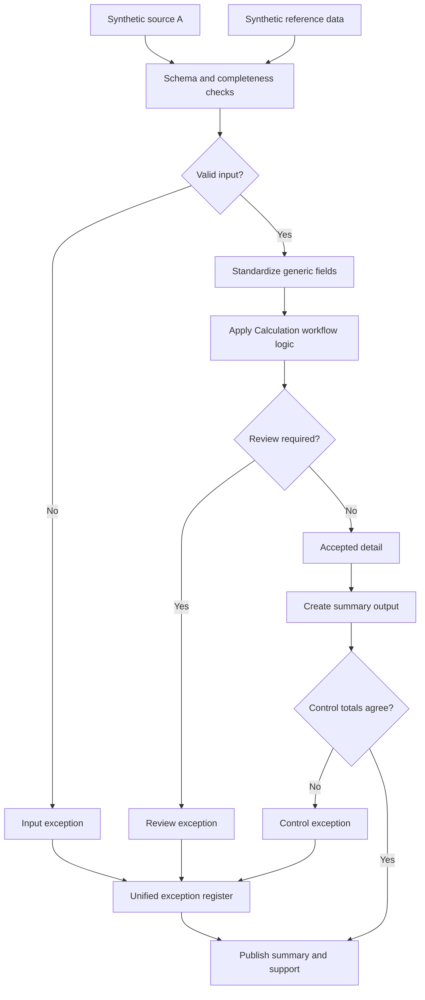

# Periodic Estimate Analysis

A recurring estimate rebuilt every month from two or three files that don't agree on formatting. The workflow here validates the inputs, applies one reasonableness rule, and refuses to publish a summary that doesn't tie to its detail.

## What this really solves

A renamed field, a missing row or a status code with a trailing space doesn't stop a spreadsheet from producing a number. The error surfaces later, after someone has used the figure.

## Business impact

Rows that fail validation stop before the calculation. Whoever signs the estimate can see what was excluded and why, and the check runs the same way when the usual preparer is out.

## How it works

Each input is validated on its own, then standardized so the match compares values and not spacing. Rows that pass go through the estimate rule: an amount above the ceiling for its category goes to review. Accepted rows feed a summary that must tie to the detail before publishing. Every rejected row lands in one exception register with a reason code.



## Steps

1. Load the primary and reference files.
2. Check required fields, unique keys and that amounts parse.
3. Standardize codes and amounts.
4. Check each dimension against the reference and its status.
5. Apply the category ceiling.
6. Split accepted from exceptions and build the summary.
7. Tie the summary to the accepted detail.

## Controls

- Required fields and duplicate keys rejected before calculation
- Reference lookup includes status; an inactive dimension is an exception
- Input count equals accepted plus exceptions, in rows and in amount
- Summary ties to detail before publishing
- One exception register with a reason per row

The ceiling in `case.json` and the data are synthetic. The tests are what show the workflow holds when the inputs are bad.

## Run it

The expected output in this folder is produced by the shared pipeline, not typed in. Rerun it or check it against what's committed:

```
cd demo/case-pipeline
python run_case.py 01 --check
python -m unittest discover -s tests -v
```

`case.json` holds this case's logic block and parameters. `documentation/CONTROL_MATRIX.md` maps every control to where its evidence lands in the output.
