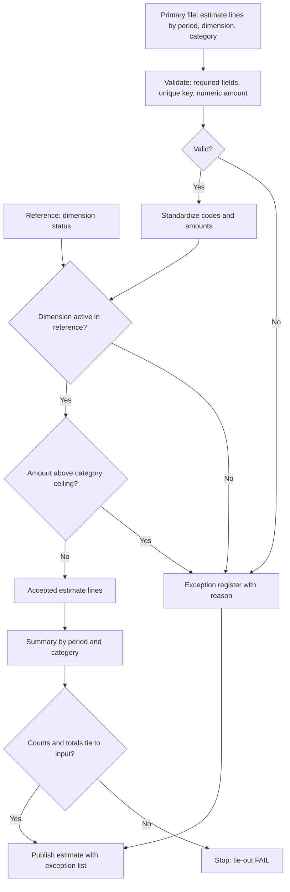

# Architecture

```mermaid
flowchart TB
 A[Primary file: estimate lines by period, dimension, category] --> V[Validate: required fields, unique key, numeric amount]
 R[Reference: dimension status] --> L{Dimension active in reference?}
 V --> V2{Valid?}
 V2 -- No --> X[Exception register with reason]
 V2 -- Yes --> S[Standardize codes and amounts]
 S --> L
 L -- No --> X
 L -- Yes --> C{Amount above category ceiling?}
 C -- Yes --> X
 C -- No --> A2[Accepted estimate lines]
 A2 --> SUM[Summary by period and category]
 SUM --> T{Counts and totals tie to input?}
 T -- No --> STOP[Stop: tie-out FAIL]
 T -- Yes --> P[Publish estimate with exception list]
 X --> P
```
