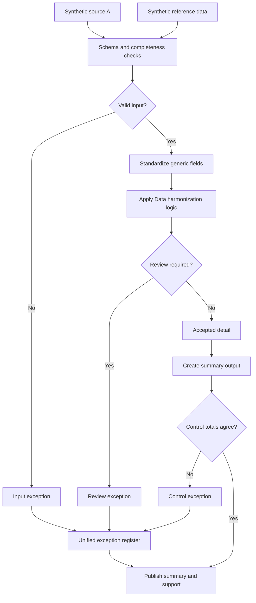

# Multi-Source Data Harmonization

The tricky part of combining data from different sources is rarely the joining itself, it's that "the same thing" gets called something different in every system. One source uses a three-letter code, another spells it out, a third leaves it blank and expects you to infer it from context. This case study works through how I'd handle that kind of mismatch in a way that's actually auditable.

## What I was solving for

Comparable records coming from multiple inputs, but with inconsistent naming, formats, periods, and status conventions. Before you can do anything useful with combined data, you need every source mapped to one canonical shape, and you need to know where each record came from in case something looks wrong later.

## Business impact

Instead of someone manually reconciling what the same field is called across
systems, every source gets mapped to one canonical shape with source lineage
kept on every row. When a total looks off, "where did this number come from"
gets answered in seconds by tracing the row back to its source — not by an
afternoon spent cross-referencing spreadsheets.

## The approach

Map each source to a common schema first, before any comparison happens. Validate periods so you're not accidentally comparing apples to a stale reference month. Deduplicate on the canonical key. And keep source lineage on every row, because "where did this number come from" is the first question anyone asks when a total looks off.

## Process, step by step

1. Load source and reference data.
2. Validate schema, required fields, and unique keys per source.
3. Standardize identifiers, dates, statuses, and values into the canonical schema.
4. Apply the harmonization logic.
5. Separate accepted, harmonized records from anything that needs review.
6. Produce the summary and supporting detail.
7. Reconcile the summary back to accepted detail.

## Controls built into the process

- Required-field and duplicate-key checks per source, before merging
- Reference completeness checks so nothing gets silently mapped to nothing
- Record counts tracked from input through to output
- Summary-to-detail tie-out
- One exception register regardless of which source or which rule flagged the record

This exercises schema design, data validation, transformation logic, and exception handling, along with documenting it clearly enough that someone else could pick it up. All data here is synthetic and built specifically for this repository.
