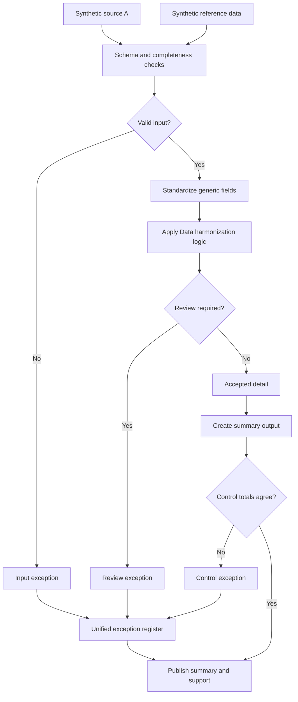

# Multi-Source Data Harmonization

Two systems describe the same thing with different codes, and one of them sometimes leaves the field empty. This case maps both to one schema and keeps the map where it can be reviewed.

## What this really solves

A reconciliation between two sources can't start until the field definitions agree, and that agreement has to exist somewhere other than the analyst's memory. Otherwise each month starts with the same discussion about what a code means.

## Business impact

When two figures disagree, the reviewer can trace each one to its source and its mapping. The reconciliation gets resolved in the meeting rather than parked.

## How it works

Each source is validated separately so a broken file can't break the merge. Codes are trimmed and upper-cased; amounts go to two decimals. Dimensions are checked against a reference table that also carries a status, so an inactive mapping is rejected rather than used. A period that isn't in the harmonization map is an exception with its own reason. Counts and totals are carried from input to output.



## Steps

1. Load each source and the reference table.
2. Validate each source on its own.
3. Standardize identifiers, codes and amounts.
4. Map dimensions through the reference and check status.
5. Reject periods that aren't in the map.
6. Build the harmonized detail and the summary.
7. Tie summary to detail.

## Controls

- Per-source validation before the merge
- Reference completeness and status
- Periods restricted to the map in `case.json`
- Record counts and totals tracked end to end
- Single exception register across sources and rules

The map is small so the unknown-period rule is visible in the output. In practice the map is the document that changes most, and versioning it is most of the work.

## Run it

The expected output in this folder is produced by the shared pipeline, not typed in. Rerun it or check it against what's committed:

```
cd demo/case-pipeline
python run_case.py 02 --check
python -m unittest discover -s tests -v
```

`case.json` holds this case's logic block and parameters. `documentation/CONTROL_MATRIX.md` maps every control to where its evidence lands in the output.
