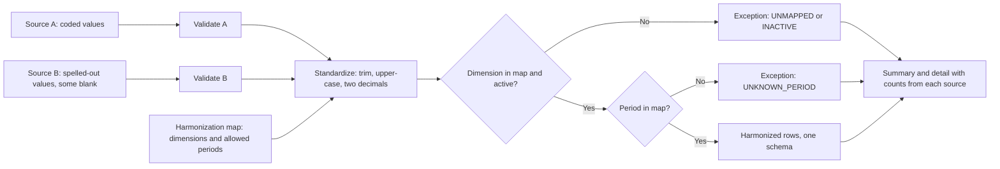

# Architecture

```mermaid
flowchart LR
 S1[Source A: coded values] --> V1[Validate A]
 S2[Source B: spelled-out values, some blank] --> V2[Validate B]
 V1 --> N[Standardize: trim, upper-case, two decimals]
 V2 --> N
 M[Harmonization map: dimensions and allowed periods] --> N
 N --> D{Dimension in map and active?}
 D -- No --> X[Exception: UNMAPPED or INACTIVE]
 D -- Yes --> P{Period in map?}
 P -- No --> X2[Exception: UNKNOWN_PERIOD]
 P -- Yes --> H[Harmonized rows, one schema]
 H --> O[Summary and detail with counts from each source]
 X --> O
 X2 --> O
```
