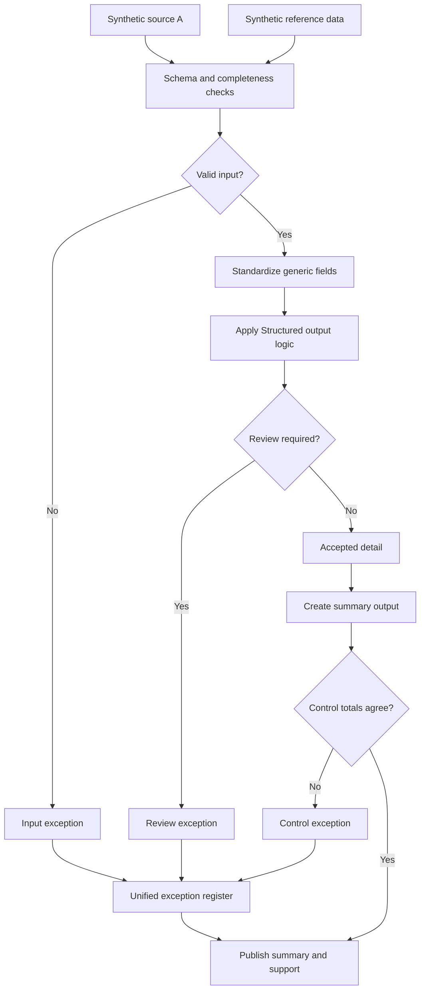

# Balanced Output Preparation

Turning detailed transaction-level records into a clean, balanced summary that still lets a reviewer drill back to the source rows.

## Problem

Detail data is messy by nature: mixed signs, inconsistent precision, records that don't map cleanly to a reporting dimension. Producing an output that's actually reviewable means fixing all of that first, not just aggregating and hoping it nets out.

## Solution

Normalize signs and rounding, assign each record to its reporting dimension, aggregate, and then check that the aggregate balances before publishing it. If it doesn't balance, that's a control exception, not a rounding footnote buried in a comment.

## Steps

1. Load source and reference data.
2. Validate schema, required fields, unique keys.
3. Standardize identifiers, dates, statuses, values.
4. Normalize sign and precision, then aggregate.
5. Split accepted detail from exceptions.
6. Build the summary output.
7. Tie summary to detail before publishing.

## Controls

- Field and key validation up front
- Reference completeness checks
- Input-to-output count reconciliation
- Summary-to-detail tie-out as the final gate before publishing
- One exception log across all failure types

This one's mostly about aggregation and balancing logic, plus the discipline of not publishing anything that doesn't tie out. Data is synthetic, generated for this repo.
