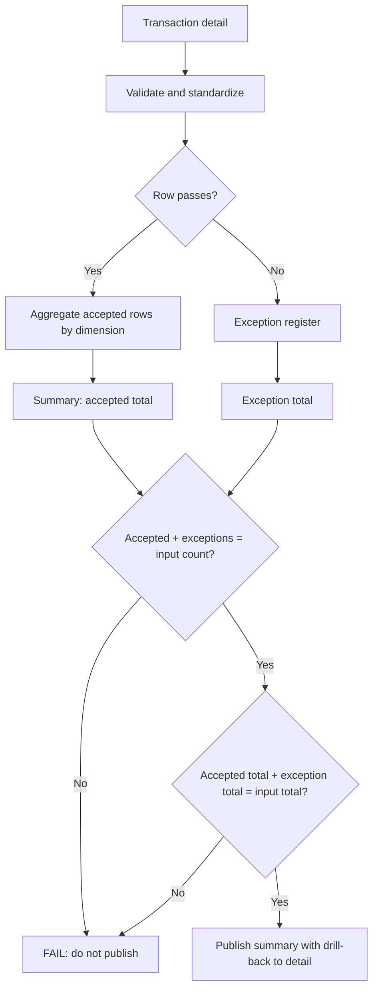

# Balanced Output Preparation

The last step before a summary leaves the team. It checks that the summary adds up to the detail it came from and stops when it doesn't.

## What this really solves

Under close pressure, a rounding mismatch or a dropped row becomes a footnote or a manual plug. Both hide the fact that the number doesn't tie.

## Business impact

A summary can't be published without a tie-out. The reader can assume the detail was checked because the process doesn't complete otherwise.

## How it works

Common validation runs first. Accepted rows are aggregated. The summary carries the input total, the accepted total and the exception total, and the pipeline writes PASS or FAIL for the count tie-out and the amount tie-out. A FAIL stops the publish step.



## Steps

1. Load and validate the detail.
2. Standardize codes and amounts.
3. Check dimensions against the reference.
4. Split accepted from exceptions.
5. Aggregate accepted rows.
6. Tie counts and amounts from input to summary.
7. Publish only on PASS.

## Controls

- Field and key validation up front
- Reference completeness
- Count reconciliation input to output
- Amount reconciliation input to output
- Summary-to-detail tie-out as the gate before publishing
- One exception log for every failure type

There is little logic here beyond the tie-out. That is the case: a summary that doesn't balance doesn't go out, and the check is automatic.

## Run it

The expected output in this folder is produced by the shared pipeline, not typed in. Rerun it or check it against what's committed:

```
cd demo/case-pipeline
python run_case.py 03 --check
python -m unittest discover -s tests -v
```

`case.json` holds this case's logic block and parameters. `documentation/CONTROL_MATRIX.md` maps every control to where its evidence lands in the output.
