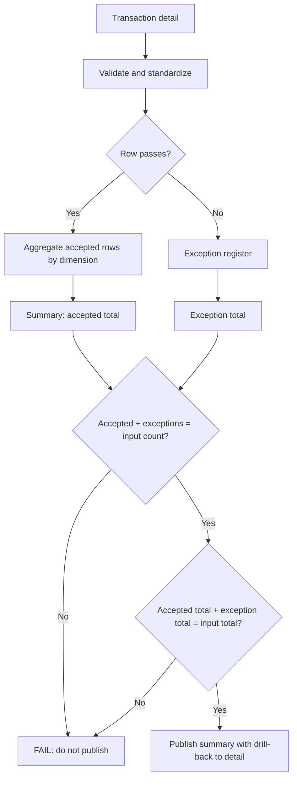

# Architecture

```mermaid
flowchart TB
 D[Transaction detail] --> V[Validate and standardize]
 V --> SPLIT{Row passes?}
 SPLIT -- No --> X[Exception register]
 SPLIT -- Yes --> AGG[Aggregate accepted rows by dimension]
 AGG --> S[Summary: accepted total]
 X --> E[Exception total]
 S --> T1{Accepted + exceptions = input count?}
 E --> T1
 T1 -- No --> F[FAIL: do not publish]
 T1 -- Yes --> T2{Accepted total + exception total = input total?}
 T2 -- No --> F
 T2 -- Yes --> PUB[Publish summary with drill-back to detail]
```
