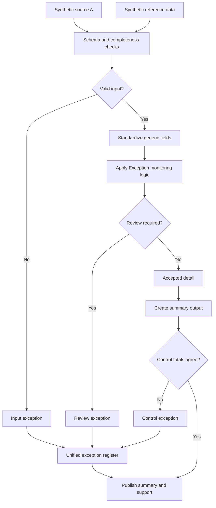

# Exception Monitoring and Prioritization

An exception report that tells the reviewer what to look at first. Without that, the report becomes a tab that opens once a quarter.

## What this really solves

A list of unresolved items needs an owner, an age and a priority per item. Without them, review time goes to whatever sits at the top of the sheet.

## Business impact

Review hours go to the largest items first. Small items are still logged and wait their turn.

## How it works

After the common validation, each accepted row gets a priority band by amount, using the thresholds in `case.json`: high, medium, low. Exceptions keep their reason code so the register can be sorted by cause as well as by size. The summary counts exceptions by reason, which over several months is the trend to watch.



## Steps

1. Load and validate the input.
2. Standardize.
3. Check reference and status.
4. Assign a priority band to each accepted row.
5. Route source-flagged rows to the register.
6. Summarize by reason and by band.
7. Tie out.

## Controls

- Required-field and duplicate-key validation
- Reference completeness so ownership can be assigned
- Priority thresholds kept in configuration
- Counts and totals reconciled input to output
- Exception register with a reason per row and a count per reason in the summary

The bands were set so the synthetic data produces all three, and the test checks that. In a live process the thresholds should come from the reviewer, not from the data.

## Run it

The expected output in this folder is produced by the shared pipeline, not typed in. Rerun it or check it against what's committed:

```
cd demo/case-pipeline
python run_case.py 04 --check
python -m unittest discover -s tests -v
```

`case.json` holds this case's logic block and parameters. `documentation/CONTROL_MATRIX.md` maps every control to where its evidence lands in the output.
