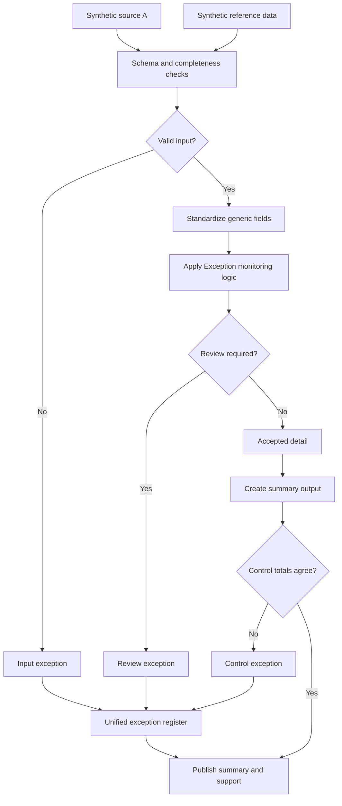

# Exception Monitoring and Prioritization

Having an exception report is one thing. Having one that tells the right person what to look at first is another. This case study is about the second part.

## What this really solves

Having a list of problems isn't the same as knowing which ones need attention right now. Plenty of "exception reports" are really just a spreadsheet tab nobody opens until it's too late to fix quietly. A pile of unresolved items isn't useful if nobody knows who owns each one, how old it is, or which ones actually matter.

## Business impact

This turns a pile of unresolved items into a ranked list, so the team's time goes to what actually matters first, instead of getting lost figuring out where to even start.

## How it works

Validated records get routed through an ownership assignment step and an age-banding calculation, and the result is a prioritized view instead of a flat list. New, unassigned, and aged-out items surface differently, so review effort goes where it's actually needed.

## Steps

1. Load source and reference data.
2. Validate schema, required fields, and unique keys.
3. Standardize identifiers, dates, statuses, and values.
4. Assign owner groups and calculate age bands.
5. Separate accepted records from items needing review.
6. Build the prioritized monitoring view and supporting detail.
7. Reconcile the summary back to detail.

## Controls

- Required-field and duplicate-key validation
- Reference completeness checks so ownership assignment doesn't fail silently
- Input-to-output count reconciliation
- Summary-to-detail tie-out
- A single exception register instead of one queue per failure type

The interesting part of this one is less the calculation and more the prioritization logic, deciding what surfaces first so review time doesn't get wasted on low-priority noise. All data is synthetic.
