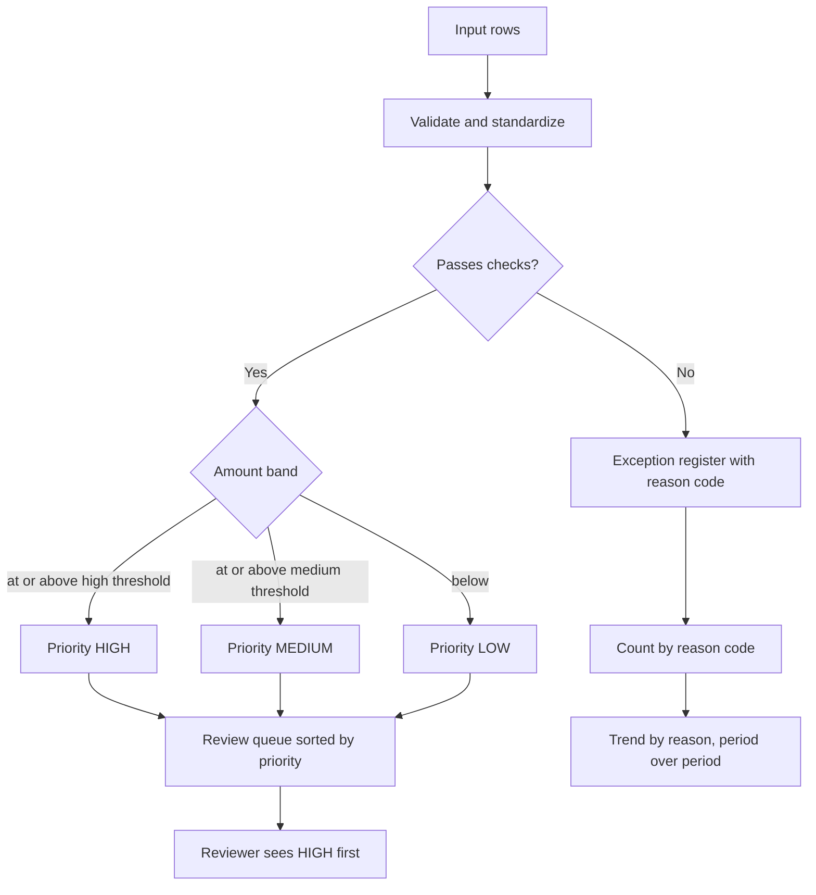

# Architecture

```mermaid
flowchart TB
 I[Input rows] --> V[Validate and standardize]
 V --> OK{Passes checks?}
 OK -- No --> R[Exception register with reason code]
 OK -- Yes --> B{Amount band}
 B -- at or above high threshold --> H[Priority HIGH]
 B -- at or above medium threshold --> M[Priority MEDIUM]
 B -- below --> L[Priority LOW]
 H --> Q[Review queue sorted by priority]
 M --> Q
 L --> Q
 R --> C[Count by reason code]
 C --> TR[Trend by reason, period over period]
 Q --> OUT[Reviewer sees HIGH first]
```
