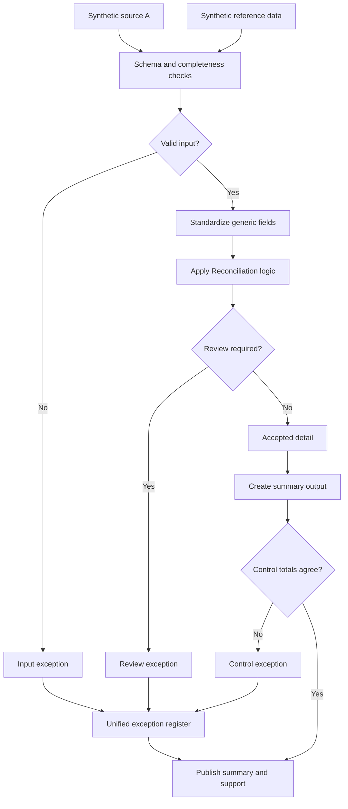

# Source-to-Record Reconciliation

Reconciliation is where a lot of "automation" projects fall apart, because the real work isn't the match, it's deciding what to do with everything that doesn't match cleanly. This one goes deeper into that logic than the other case studies.

## Business impact

This control turns a manual validation process (2–4 hours per run, with
errors that surface late) into a systematic check that takes minutes. It
gives the business owner or department lead certainty that no number reaches
a report without being reconciled, with every exception documented and
traceable. In other words: not just faster, but more reliable and less
dependent on any one person.

## The core problem

Two independently generated datasets rarely agree perfectly, even when they're supposed to represent the same thing. Identifiers get formatted differently, precision varies, signs flip, and one side has records the other doesn't. A reconciliation that only handles the matched rows isn't really a reconciliation.

## How I approached it

Standardize both sides first so you're not comparing apples to oranges on formatting alone. Then do a full outer match, not an inner join, so unmatched records on either side stay visible instead of silently vanishing. Calculate differences on anything that does match. Classify everything else, missing-from-source, missing-from-record, timing difference, or genuine break, and route it into review accordingly.

## Process walkthrough

1. Load both datasets and the reference data.
2. Validate schema, required fields, and unique keys on each side independently.
3. Standardize identifiers, dates, statuses, and values so the match logic isn't comparing noise.
4. Run a full outer match and calculate differences.
5. Separate matched-and-agreed records from anything needing review.
6. Build the summary and supporting detail.
7. Tie the summary back to the accepted detail.

## Controls demonstrated

- Independent validation of both source datasets before matching
- Full outer match, so unmatched populations on either side stay visible instead of getting dropped by an inner join
- Input-to-output record counts on both sides
- Summary-to-detail tie-out
- One exception register covering both input issues and match breaks

The full outer match is the design decision that matters most here. It's slower and messier than an inner join, but an inner join would quietly discard exactly the records a reconciliation exists to catch. Everything here runs on synthetic data built for this repo, not a real dataset.
