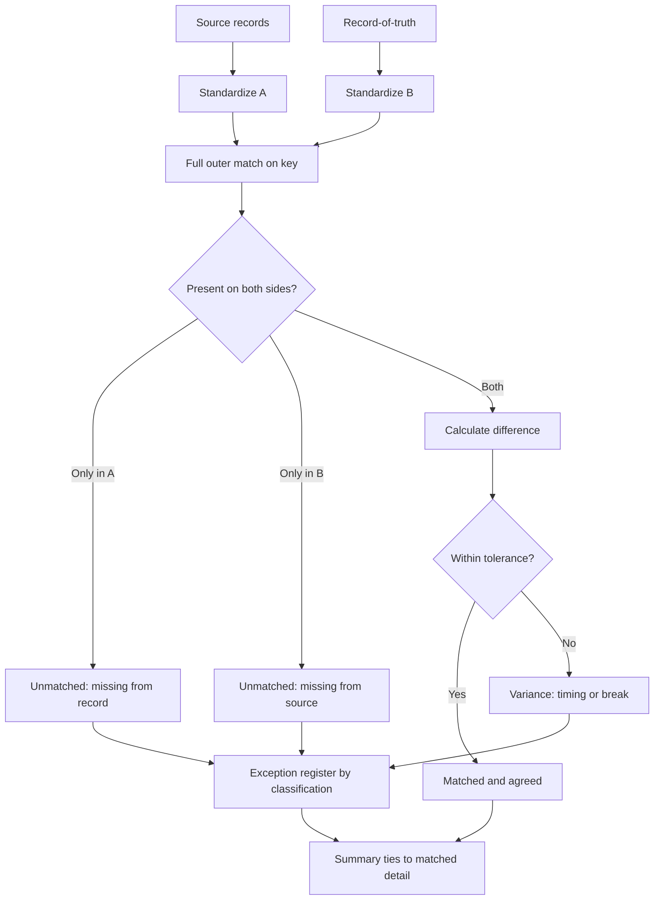

# Source-to-Record Reconciliation

Two sets of records that should agree. The match is the easy part; the work is deciding what happens to every row that doesn't match cleanly.

## What this really solves

One side has rows the other doesn't. Identifiers are formatted differently. Amounts round differently. A reconciliation that only keeps the matched rows drops the ones it exists to find.

## Business impact

A manual check of two to four hours per run, with errors found late, becomes a run of minutes with every break documented. The review no longer depends on one person knowing the history.

## How it works

Both sides are standardized first. The match is a full outer join, so unmatched rows on either side remain visible. Differences are calculated on matched rows. Everything else is classified as missing from source, missing from record, timing, or a break, and routed to review with that classification. The runnable demo in `demo/python-reconciliation-demo` is this logic with a tolerance parameter; the shared pipeline covers validation.



## Steps

1. Load both datasets and the reference.
2. Validate each side on its own.
3. Standardize identifiers, dates, statuses and amounts.
4. Full outer match and difference calculation.
5. Separate matched-and-agreed from rows needing review.
6. Build summary and detail.
7. Tie summary to accepted detail.

## Controls

- Independent validation of both sides before matching
- Full outer match so unmatched populations aren't dropped
- Input-to-output record counts on both sides
- Summary-to-detail tie-out
- One exception register for input problems and match breaks

The full outer join is the design choice. It is slower and produces more output than an inner join. An inner join would discard the rows a reconciliation is for.

## Run it

The expected output in this folder is produced by the shared pipeline, not typed in. Rerun it or check it against what's committed:

```
cd demo/case-pipeline
python run_case.py 05 --check
python -m unittest discover -s tests -v
```

`case.json` holds this case's logic block and parameters. `documentation/CONTROL_MATRIX.md` maps every control to where its evidence lands in the output.
