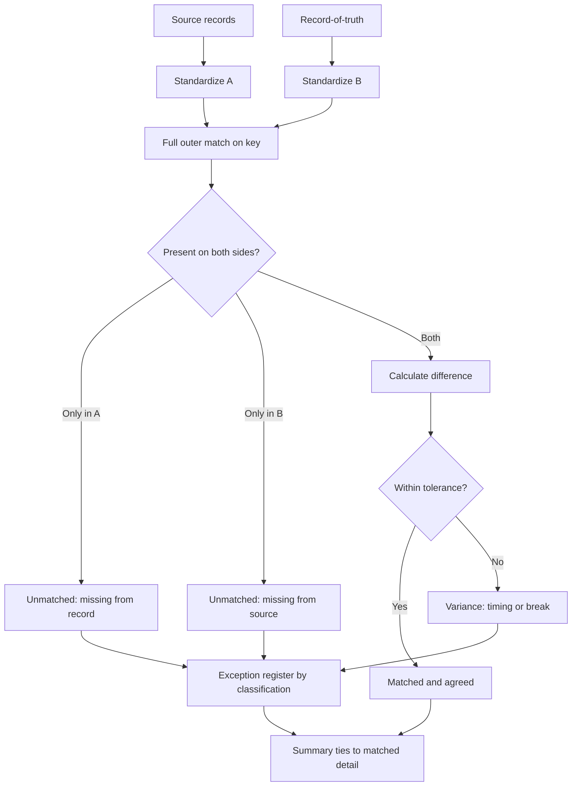

# Architecture

```mermaid
flowchart TB
 A[Source records] --> SA[Standardize A]
 B[Record-of-truth] --> SB[Standardize B]
 SA --> J[Full outer match on key]
 SB --> J
 J --> MA{Present on both sides?}
 MA -- Only in A --> XA[Unmatched: missing from record]
 MA -- Only in B --> XB[Unmatched: missing from source]
 MA -- Both --> DIF[Calculate difference]
 DIF --> TOL{Within tolerance?}
 TOL -- Yes --> OK[Matched and agreed]
 TOL -- No --> BRK[Variance: timing or break]
 XA --> REG[Exception register by classification]
 XB --> REG
 BRK --> REG
 OK --> SUM[Summary ties to matched detail]
 REG --> SUM
```
