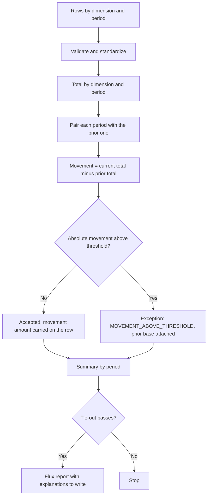

# Period-Over-Period Analysis

This month against last month, with the threshold written down so the review doesn't depend on who runs it.

## What this really solves

A movement that would surprise the controller gets found after the report is out, by the controller. The review needs a threshold applied the same way every period.

## Business impact

Large movements are flagged before the numbers leave the team, with the prior-period base attached. The explanation gets written once.

## How it works

After validation, the pipeline totals each dimension by period and compares each period with the previous one. Movements above an absolute threshold from `case.json` send that dimension-period to review. Accepted rows carry the movement amount so the reviewer has the context without a second query. The threshold is an amount rather than a percentage: on a small base a percentage flags everything, and an amount behaves like the materiality used in a flux review.



## Steps

1. Load and validate.
2. Standardize.
3. Total by dimension and period.
4. Compare each period against the prior one.
5. Flag movements above the threshold.
6. Carry the movement amount on accepted rows.
7. Summarize and tie out.

## Controls

- Required-field and duplicate-key validation
- Reference completeness so the comparison has a base
- Threshold in configuration, applied the same way every period
- Counts and totals reconciled
- Exception register covering input issues and movement flags

The synthetic data has one injected movement, and the test expects it to be caught. Setting the threshold for a live process is a judgment call that belongs with the reviewer.

## Run it

The expected output in this folder is produced by the shared pipeline, not typed in. Rerun it or check it against what's committed:

```
cd demo/case-pipeline
python run_case.py 06 --check
python -m unittest discover -s tests -v
```

`case.json` holds this case's logic block and parameters. `documentation/CONTROL_MATRIX.md` maps every control to where its evidence lands in the output.
