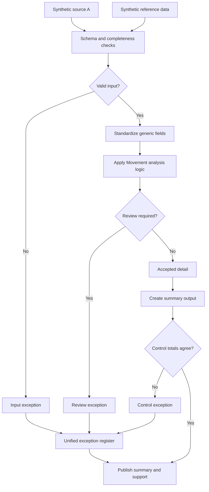

# Period-Over-Period Analysis

What changed since last period, and does the change actually make sense? That's the question this workflow is built to answer without someone eyeballing two spreadsheets side by side.

## What this really solves

Comparing this month to last sounds simple, but doing it by hand means someone has to notice which changes are normal and which ones deserve a second look — and that judgment call shouldn't depend on who happens to be reviewing it that day.

## Business impact

Real variances get flagged automatically before they turn into a surprise in the report, so a controller sees a problem coming instead of explaining one after the fact.

## How it works

Recurring outputs need a current-versus-prior comparison almost every cycle, but doing that comparison by hand means someone has to notice which movements are normal and which ones deserve a second look. That judgment call shouldn't depend on who happens to be doing the review that month. The approach: calculate current-period values, join in the prior period, and flag movements that cross a threshold for review. Everything else flows through as accepted, with the movement calculation itself kept in the supporting output so a reviewer can see the math, not just the flag.

## Steps

1. Load current and prior-period source data.
2. Validate schema, required fields, and unique keys.
3. Standardize identifiers, dates, statuses, and values.
4. Calculate current values and join prior-period values.
5. Flag movements beyond threshold for review; pass the rest through as accepted.
6. Build the summary and supporting output.
7. Reconcile summary to accepted detail.

## Controls

- Required-field and duplicate-key validation
- Reference completeness, so the prior-period join doesn't silently fail
- Input-to-output count reconciliation
- Summary-to-detail tie-out
- One exception register for both input issues and movement flags

The threshold logic is the part worth calling out. Too tight and reviewers drown in noise; too loose and real movements slip through unflagged. Getting that balance right is as much a judgment call as a coding problem. Data is synthetic, built for this repo.
