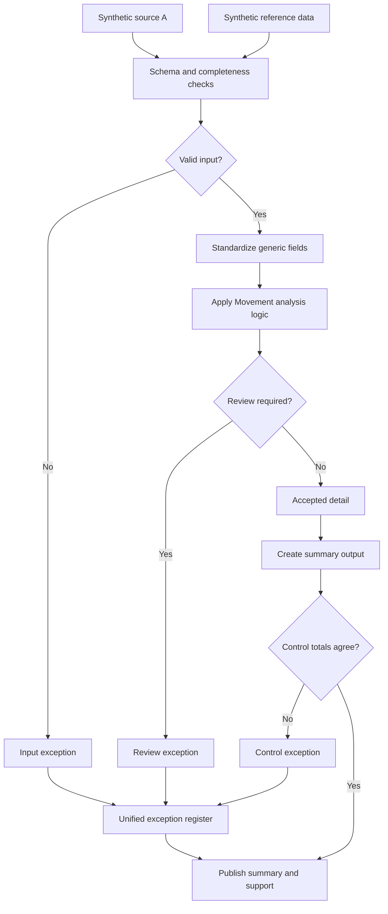

# Architecture

```mermaid
flowchart TB
 A1[Synthetic source A] --> B[Schema and completeness checks]
 A2[Synthetic reference data] --> B
 B --> C{Valid input?}
 C -- No --> X1[Input exception]
 C -- Yes --> D[Standardize generic fields]
 D --> E[Apply Movement analysis logic]
 E --> F{Review required?}
 F -- Yes --> X2[Review exception]
 F -- No --> G[Accepted detail]
 G --> H[Create summary output]
 H --> I{Control totals agree?}
 I -- No --> X3[Control exception]
 I -- Yes --> J[Publish summary and support]
 X1 --> K[Unified exception register]
 X2 --> K
 X3 --> K
 K --> J
```
