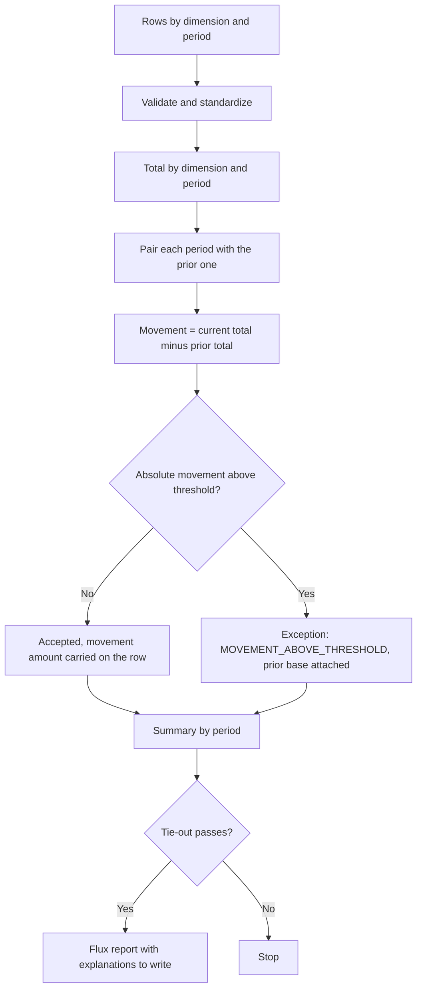

# Architecture

```mermaid
flowchart TB
 I[Rows by dimension and period] --> V[Validate and standardize]
 V --> T[Total by dimension and period]
 T --> PR[Pair each period with the prior one]
 PR --> MV[Movement = current total minus prior total]
 MV --> TH{Absolute movement above threshold?}
 TH -- Yes --> X[Exception: MOVEMENT_ABOVE_THRESHOLD, prior base attached]
 TH -- No --> A[Accepted, movement amount carried on the row]
 A --> S[Summary by period]
 X --> S
 S --> C{Tie-out passes?}
 C -- Yes --> P[Flux report with explanations to write]
 C -- No --> F[Stop]
```
