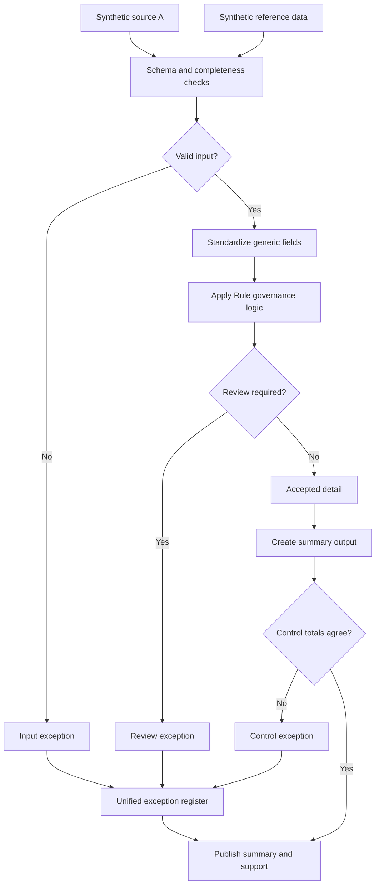

# Policy-Driven Calculation Governance

Calculations don't stay static. Rates change, thresholds get revised, policies get updated mid-year, and if the logic isn't versioned, you eventually lose track of which rule applied to which period. This case study is about governing that change instead of hardcoding it.

## What this really solves

Calculation rules change — rates get updated, policies shift mid-year — and when that logic lives in someone's head or a buried spreadsheet formula, nobody can explain months later why a number came out the way it did.

## Business impact

Keeping the rules in one versioned place means the business can always answer "why did this happen." The process keeps working even if the person who built it changes roles, takes leave, or leaves the company.

## How it works

When rules, assumptions, and approvals for a recurring calculation live in different places, or worse, in someone's memory, the calculation becomes impossible to audit after the fact. You can't answer "why did this come out this way" six months later if the rule that produced it already changed twice since then. The approach: keep rules in a versioned table rather than embedded in the code, validate that only active, approved rules get applied, record the assumptions behind each run, and package the whole thing for reviewer sign-off along with a movement analysis showing what changed versus the prior version.

## Steps

1. Load input data and the versioned rule table.
2. Validate schema, required fields, and unique keys.
3. Standardize identifiers, dates, statuses, and values.
4. Apply only active, approved rule versions.
5. Record assumptions and separate accepted results from exceptions.
6. Build the summary, including a movement analysis against the prior rule version.
7. Reconcile summary to accepted detail before packaging for reviewer sign-off.

## Controls

- Rule status validation, so a superseded or unapproved rule can never fire
- Input-to-output count reconciliation
- Assumption logging tied to each run
- Summary-to-detail tie-out
- One exception register covering input issues and rule-application failures

Versioning the rules instead of hardcoding them is the main design decision here. It costs more up front, but it's the only way to answer "what rule applied when" later, which is exactly the question that comes up in review. Data is synthetic, built for this repo.
