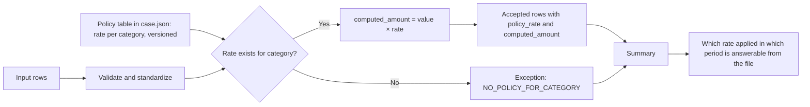

# Policy-Driven Calculation Governance

Rates change and policies get revised mid-year. This case keeps the rules in a versioned file instead of in the code or in a spreadsheet formula.

## What this really solves

When a rate lives in a buried formula, the question "why did this come out this way" has no answer six months later, and none at all when the person who built it is on leave.

## Business impact

Rules are in one file with a version. Anyone can read which rate applied to which category. A category with no approved rate produces an exception instead of a default.

## How it works

The policy table is in `case.json` as a rate per category. Accepted rows get their rate and a computed amount. A row whose category has no rate goes to the register with its own reason. Defaulting to zero or to the nearest rate would keep the process running and hide the missing policy.



## Steps

1. Load and validate.
2. Standardize.
3. Check reference and status.
4. Look up the policy rate by category.
5. Reject rows with no policy.
6. Compute and summarize.
7. Tie out.

## Controls

- Rule existence checked before anything is calculated
- No default rate; a missing policy is an exception
- Input-to-output count reconciliation
- Summary-to-detail tie-out
- Exception register covering input problems and rule-application failures

Versioning the rules costs more up front than hardcoding them. It is the only way to answer which rule applied in which period, which is the question that comes up in review.

## Run it

The expected output in this folder is produced by the shared pipeline, not typed in. Rerun it or check it against what's committed:

```
cd demo/case-pipeline
python run_case.py 07 --check
python -m unittest discover -s tests -v
```

`case.json` holds this case's logic block and parameters. `documentation/CONTROL_MATRIX.md` maps every control to where its evidence lands in the output.
