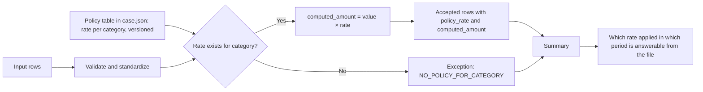

# Architecture

```mermaid
flowchart LR
 POL[Policy table in case.json: rate per category, versioned] --> LK
 I[Input rows] --> V[Validate and standardize]
 V --> LK{Rate exists for category?}
 LK -- No --> X[Exception: NO_POLICY_FOR_CATEGORY]
 LK -- Yes --> CALC[computed_amount = value × rate]
 CALC --> A[Accepted rows with policy_rate and computed_amount]
 A --> S[Summary]
 X --> S
 S --> AUD[Which rate applied in which period is answerable from the file]
```
