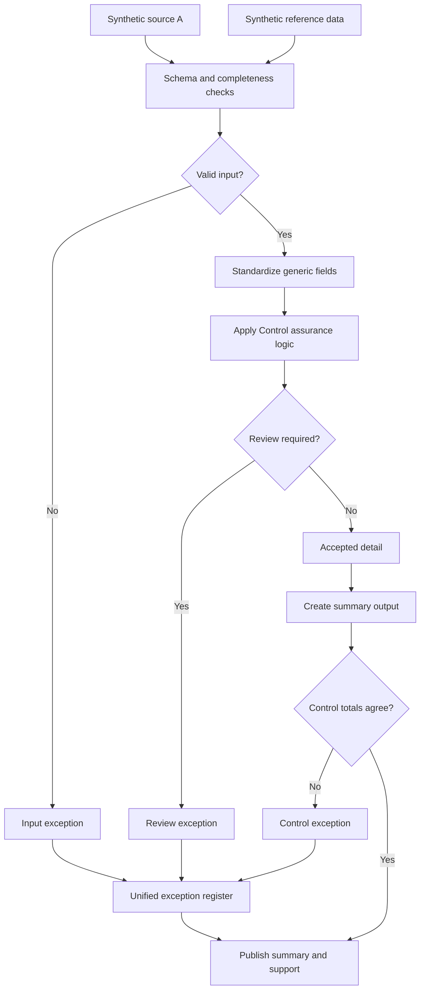

# Control Evidence and Assurance Lifecycle

A control that runs but leaves no evidence behind is functionally the same as no control at all, at least from an auditor's perspective. This case study is about closing that gap: making sure execution, exceptions, remediation, and sign-off are all captured somewhere a reviewer can actually find them later.

## Business problem

Controls tend to get evidenced piecemeal, ownership in one tracker, review criteria in a policy doc, exceptions in an email thread, retention rules nobody remembers until an audit asks. By the time someone needs to reconstruct what happened, half the trail is gone.

## Generalized solution

Define roles and evidence requirements up front, review execution against those requirements, track remediation on anything that fails, and compile a certification status that rolls everything up into one place.

## Process walkthrough

1. Load control execution data and the reference control catalog.
2. Validate schema, required fields, and unique keys.
3. Standardize identifiers, dates, statuses, and values.
4. Apply evidence requirements per control.
5. Separate controls with complete evidence from those needing remediation.
6. Build the certification summary and supporting detail.
7. Reconcile summary to accepted detail.

## Controls demonstrated

- Required-field and duplicate-key validation on execution records
- Reference completeness against the control catalog
- Input-to-output count reconciliation
- Summary-to-detail tie-out
- One exception register for both missing evidence and control breaks

The lifecycle piece is what makes this different from a one-off control check: remediation status carries forward until it's actually closed, instead of resetting every period. Data is synthetic, built for this repo.
