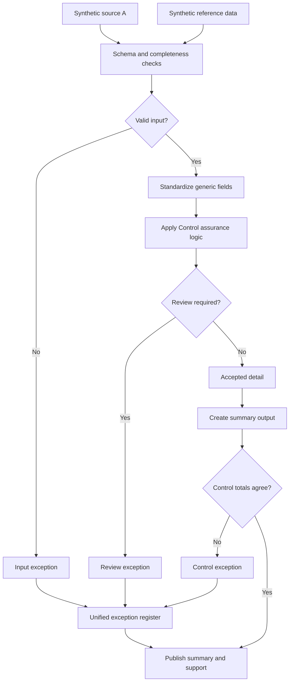

# Control Evidence and Assurance Lifecycle

A control that runs and leaves no evidence is, for an auditor, the same as no control. This case captures execution, exceptions, remediation and sign-off in one register.

## What this really solves

Evidence spread across a tracker, an email thread and someone's memory takes too long to reconstruct, and the reconstruction always happens while the auditor is waiting.

## Business impact

Evidence is produced as part of the work. Audit requests are answered from the register, and open items stay open until someone closes them.

## How it works

Execution records go through the common validation and are checked against the control catalog in the reference file. A record whose control is no longer active in the catalog is an exception, because evidence against a retired control doesn't count. The summary counts exceptions by reason so remediation can be tracked from one period to the next.



## Steps

1. Load execution records and the control catalog.
2. Validate and standardize.
3. Check each record against the catalog and its status.
4. Route source-flagged records to review.
5. Summarize by reason.
6. Tie out.
7. Carry open items forward.

## Controls

- Validation on execution records
- Catalog completeness and status
- Input-to-output count reconciliation
- Summary-to-detail tie-out
- Single register for missing evidence and control breaks

Remediation status carries forward until it is closed. That is what separates a lifecycle from a one-off check.

## Run it

The expected output in this folder is produced by the shared pipeline, not typed in. Rerun it or check it against what's committed:

```
cd demo/case-pipeline
python run_case.py 08 --check
python -m unittest discover -s tests -v
```

`case.json` holds this case's logic block and parameters. `documentation/CONTROL_MATRIX.md` maps every control to where its evidence lands in the output.
