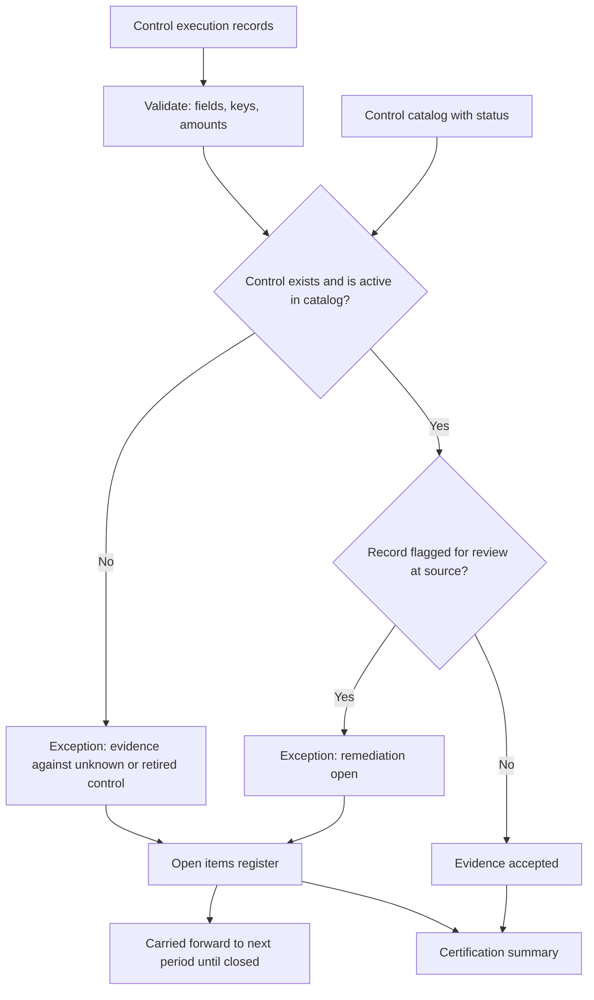

# Architecture

```mermaid
flowchart TB
 E[Control execution records] --> V[Validate: fields, keys, amounts]
 CAT[Control catalog with status] --> CK
 V --> CK{Control exists and is active in catalog?}
 CK -- No --> X1[Exception: evidence against unknown or retired control]
 CK -- Yes --> ST{Record flagged for review at source?}
 ST -- Yes --> X2[Exception: remediation open]
 ST -- No --> OK[Evidence accepted]
 OK --> CERT[Certification summary]
 X1 --> REG[Open items register]
 X2 --> REG
 REG --> NEXT[Carried forward to next period until closed]
 REG --> CERT
```
