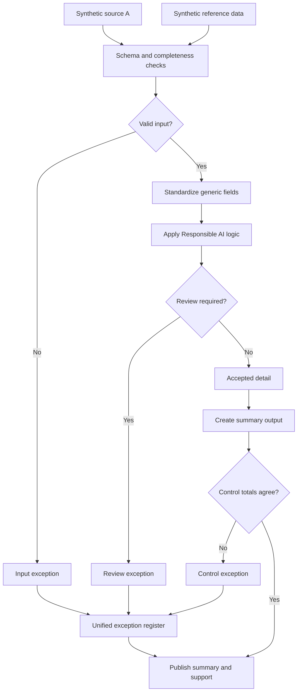

# AI-Assisted Knowledge Capture

This one's a bit different from the rest, it's about using AI as part of the documentation process itself, and being explicit about where the human review sits.

## What this really solves

When only one person really understands how a process works, that knowledge is one resignation away from disappearing. Ask two different people to explain the same process and you'll usually get two different answers — one gives you a narrative, the other a bullet list missing half the exceptions.

## Business impact

Using AI to draft documentation — always checked against the real source before anyone trusts it — makes process knowledge less dependent on any single person, so handoffs and transitions don't start from zero.

## How it works

AI can help draft a consistent writeup fast, but only if the draft gets checked against the actual source material before anyone trusts it. The approach: start from a synthetic transcript, draft a writeup using a standard prompt, then verify the draft against the source line by line rather than taking it at face value. A human reviews it, and the final version gets versioned so you can see what changed between drafts. The AI drafts; it doesn't get the last word.

## Steps

1. Load the synthetic transcript and reference material.
2. Validate schema and completeness of the source content.
3. Standardize terminology and structure.
4. Draft the writeup using a standard prompt.
5. Verify the draft against source; anything unverified goes to review.
6. Produce the reviewed summary and supporting detail.
7. Reconcile the final version back to what was actually verified.

## Controls

- Source completeness checks before drafting starts
- Line-by-line verification of AI-drafted content against source
- Human review as a required gate, not optional
- Version tracking between draft and final
- One exception register for anything that couldn't be verified

The point of this case study is less the workflow diagram and more the principle behind it: AI output is a draft, always, and the review step is where accountability actually lives. Everything here, including the transcript, is synthetic.
