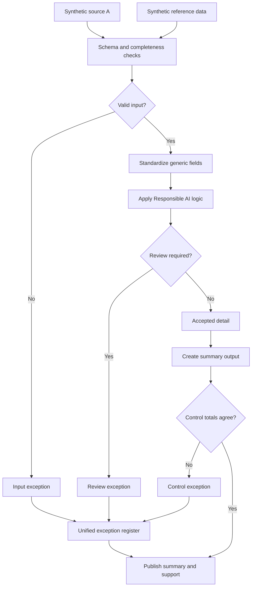

# AI-Assisted Knowledge Capture

Using AI inside the documentation process, with the review step stated rather than assumed.

## What this really solves

When one person is the only one who knows how a process works, that knowledge leaves with them. Two people asked to describe the same process produce different documents with different exceptions.

## Business impact

An AI draft, checked against the source before anyone relies on it, makes process knowledge less dependent on one person. A handover doesn't start from zero.

## How it works

Start from a synthetic transcript. Draft a write-up with a standard prompt. Verify the draft against the source line by line. A person reviews it. The final version is kept with its draft so the changes are visible. In the pipeline this appears as a review flag: anything unverified goes to the register.



## Steps

1. Load the synthetic transcript and reference material.
2. Validate schema and completeness.
3. Standardize terminology and structure.
4. Draft with a standard prompt.
5. Verify against source; unverified content goes to review.
6. Produce the reviewed summary.
7. Reconcile the final to what was verified.

## Controls

- Source completeness checked before drafting
- Line-by-line verification of AI-drafted content
- Human review as a required gate
- Version kept between draft and final
- One register for anything unverified

AI output is a draft. The review step is where accountability sits.

## Run it

The expected output in this folder is produced by the shared pipeline, not typed in. Rerun it or check it against what's committed:

```
cd demo/case-pipeline
python run_case.py 09 --check
python -m unittest discover -s tests -v
```

`case.json` holds this case's logic block and parameters. `documentation/CONTROL_MATRIX.md` maps every control to where its evidence lands in the output.
