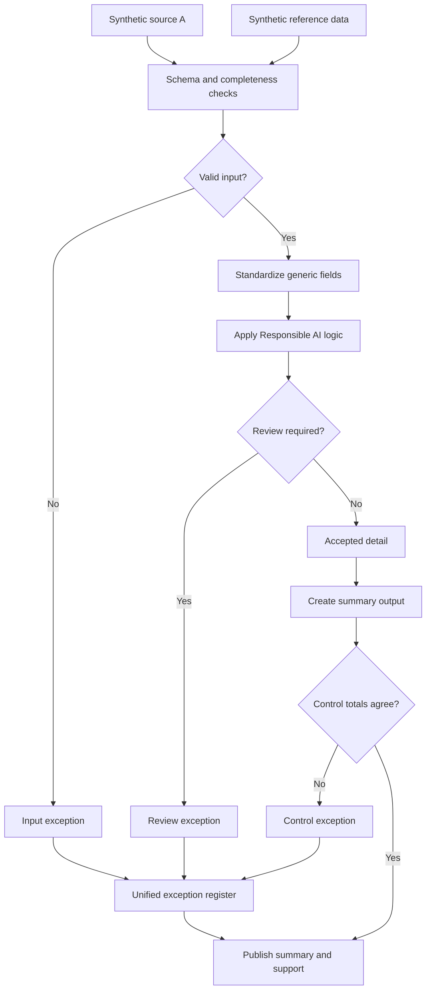

# AI-Assisted Knowledge Capture

This one's a bit different from the rest, it's about using AI as part of the documentation process itself, and being explicit about where the human review sits.

## Why this matters

Process knowledge usually lives in someone's head and gets written down inconsistently, if at all. Interview one person about how a process works and you get a narrative; interview another and you get a bullet list missing half the exceptions. AI can help draft a consistent writeup fast, but only if the draft gets checked against the actual source material before anyone trusts it.

## How I set it up

Start from a synthetic transcript, draft a writeup using a standard prompt, then verify the draft against the source line by line rather than taking it at face value. A human reviews it, and the final version gets versioned so you can see what changed between drafts. The AI drafts; it doesn't get the last word.

## Process walkthrough

1. Load the synthetic transcript and reference material.
2. Validate schema and completeness of the source content.
3. Standardize terminology and structure.
4. Draft the writeup using a standard prompt.
5. Verify the draft against source; anything unverified goes to review.
6. Produce the reviewed summary and supporting detail.
7. Reconcile the final version back to what was actually verified.

## Controls demonstrated

- Source completeness checks before drafting starts
- Line-by-line verification of AI-drafted content against source
- Human review as a required gate, not optional
- Version tracking between draft and final
- One exception register for anything that couldn't be verified

The point of this case study is less the workflow diagram and more the principle behind it: AI output is a draft, always, and the review step is where accountability actually lives. Everything here, including the transcript, is synthetic.
