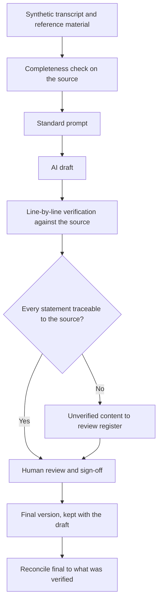

# Architecture

```mermaid
flowchart TB
 SRC[Synthetic transcript and reference material] --> CHK[Completeness check on the source]
 CHK --> PR[Standard prompt]
 PR --> DR[AI draft]
 DR --> VER[Line-by-line verification against the source]
 VER --> Q{Every statement traceable to the source?}
 Q -- No --> X[Unverified content to review register]
 Q -- Yes --> HR[Human review and sign-off]
 X --> HR
 HR --> FIN[Final version, kept with the draft]
 FIN --> REC[Reconcile final to what was verified]
```
