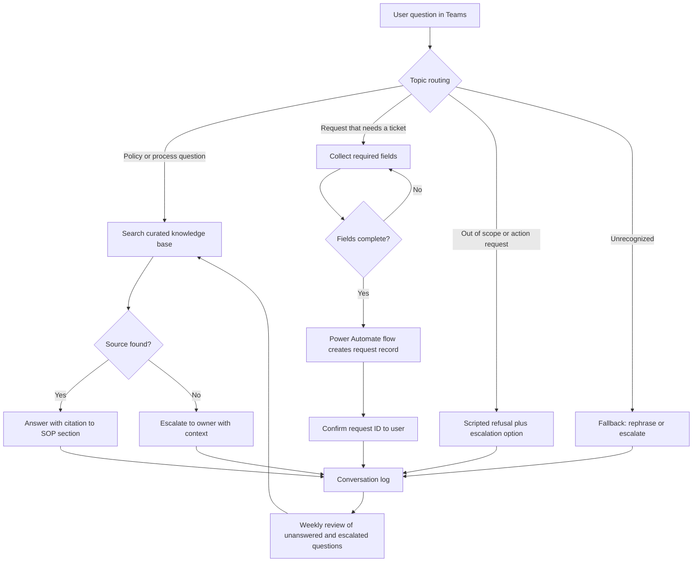

# Copilot Studio Finance Agent

An agent that answers finance policy and process questions from approved documents. It can't post, approve or edit anything, and that limit is in the configuration rather than in the prompt.

## What this really solves

Finance teams answer the same questions repeatedly: the review threshold for a manual journal, the right template for a balance sheet reconciliation, where the close calendar is. The answers are in SOPs that few people open, so the analyst who knows them becomes the help desk and a single point of failure at the same time.

## Business impact

Repetitive questions come off the experienced people. Everyone gets the same answer with the source cited. Questions the SOPs can't answer are logged and go to a person, and the SOP gets fixed.

## How it works

Built in Microsoft Copilot Studio. The knowledge is a small set of synthetic SOPs and an FAQ file, both in this folder. Trigger phrases route each question to a topic. A topic answers from the knowledge base with a citation, or collects a few fields and calls a Power Automate flow to create a request record, or escalates to a person with the transcript attached. Any request to change data, approve something or leave finance policy gets a scripted refusal and the option to escalate.



## Steps

1. Curate the knowledge base: approved SOPs and the FAQ, each with an owner and a version.
2. Define one topic per question family, plus a fallback.
3. Ground every answer in a source document and show the citation.
4. For requests that need a record, collect the fields and call the flow.
5. Refuse anything that asks the agent to change data, approve, or leave finance policy.
6. Log every conversation. Review unanswered and escalated ones weekly.
7. Fix gaps in the SOPs.

## Controls

- Knowledge base allowlisted; web browsing and general model knowledge disabled
- Every answer carries a citation to the SOP section
- No topic has an action that writes to a finance system
- Scripted refusals for out-of-scope and action requests, with an escalation path
- Conversation logs reviewed weekly; unanswered questions become knowledge base tickets with an owner
- Conversation test set run before any change to topics or knowledge

## What's in this folder

| Path | What it is |
|---|---|
| `agent-config/topics.yaml` | Topics, trigger phrases, and what each one does |
| `agent-config/guardrails.md` | The scope boundary in plain language, and the refusal wording |
| `sample-data/knowledge-base/` | Synthetic SOPs and FAQ the agent is grounded on |
| `documentation/AGENT_DESIGN.md` | Design notes, knowledge sources, actions, and Teams deployment |
| `documentation/TEST_CASES.md` | Conversation test set with expected routing |
| `documentation/CONTROL_MATRIX.md` | Each control and where its evidence lives |
| `evaluation/` | A small Python simulation of the routing logic so the test set can run in CI |
| `expected-output/` | Routing results and a summary from the evaluation |

## On the evaluation script

Copilot Studio doesn't run inside a GitHub Action. A small Python router applies the trigger phrases and priority rules from `topics.yaml` to the test conversations and reports where each one landed. It stands in for the topic routing; it isn't a copy of Copilot Studio. The purpose is a versioned test set that fails when a trigger edit breaks a case. On the first run it failed one: "reconciling item" didn't match "reconciliation". The trigger was added and the case is in the set.

```
cd case-studies/11-copilot-studio-finance-agent/evaluation
python evaluate_agent.py
python -m unittest discover -s tests -v
```

Everything in this folder is synthetic: the SOPs, the FAQ, the thresholds, the close days.
