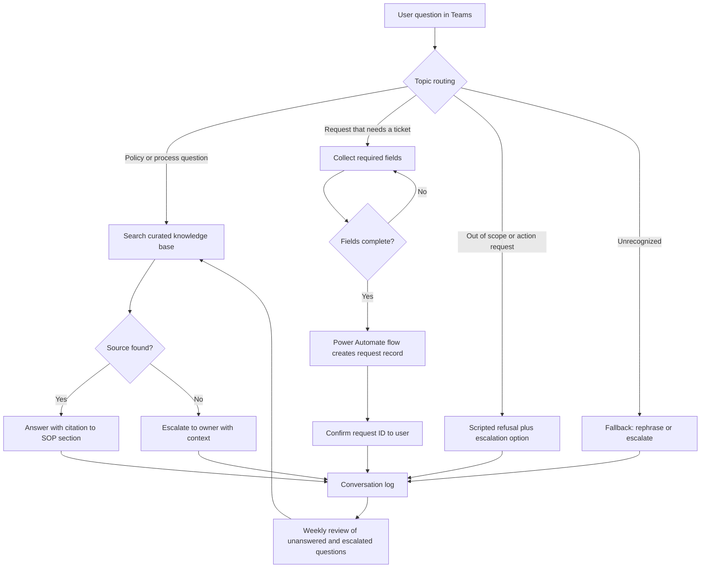

# Architecture

```mermaid
flowchart TB
 U[User question in Teams] --> T{Topic routing}
 T -- Policy or process question --> K[Search curated knowledge base]
 K --> C{Source found?}
 C -- Yes --> A[Answer with citation to SOP section]
 C -- No --> E1[Escalate to owner with context]
 T -- Request that needs a ticket --> Q[Collect required fields]
 Q --> V{Fields complete?}
 V -- No --> Q
 V -- Yes --> F[Power Automate flow creates request record]
 F --> A2[Confirm request ID to user]
 T -- Out of scope or action request --> R[Scripted refusal plus escalation option]
 T -- Unrecognized --> E2[Fallback: rephrase or escalate]
 A --> L[Conversation log]
 A2 --> L
 R --> L
 E1 --> L
 E2 --> L
 L --> M[Weekly review of unanswered and escalated questions]
 M --> K
```
