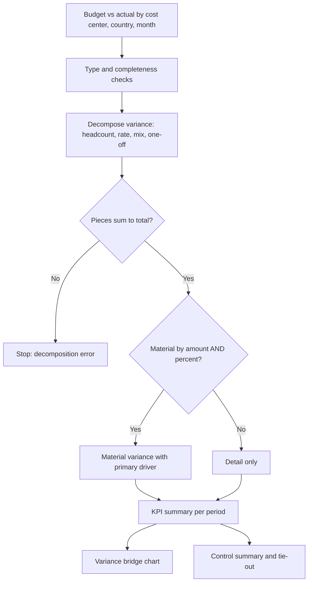
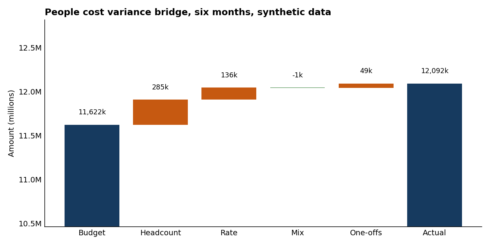

# People Cost Variance Analysis

Budget against actual for people cost, split into headcount, rate, mix and one-offs, with a materiality rule that accounts for the size of the base. People cost is usually the largest opex line and the one with the vaguest explanations.

## What this really solves

A report says a cost center is 12% over. The questions that follow are the same every month: more people or more expensive people, one-off or run-rate, and whether it matters given the size of the base. Done by hand for eighteen cost-center and country pairs, that is a day of pivot tables and the answer depends on who builds them.

## Business impact

Each variance is split the same way every month. Material lines surface on their own with a named driver. The KPIs on the monthly page come from the same lines as the detail, so they can't disagree with it.

## How it works

Budget is headcount times a loaded rate. Actual is headcount times rate plus anything one-off, such as severance or a bonus true-up. The variance splits into four pieces that add up on every line: headcount effect (change in people at budget rate), rate effect (change in rate at budget headcount), mix (the cross term) and one-offs. A line is material only if it clears both an absolute threshold and a percentage. A small cost center at 50% over may be immaterial; a large one at 3% may not be. Three KPIs per period: people cost as a share of revenue, loaded cost per FTE, and budget accuracy.



## Steps

1. Load the monthly file. Headcount as integers, rates as amounts.
2. Split each line into the four effects.
3. Check that the four effects sum to actual minus budget on every line. Stop if they don't.
4. Flag material lines and name the primary driver.
5. Aggregate KPIs per period.
6. Draw the bridge from budget to actual.
7. Write the control summary.

## What the output says on this data

Six months, six cost centers, three countries. Total variance is about 470k on an 11.6M budget, around 4%. The bridge attributes 285k to headcount, 136k to rate, 49k to two one-offs, and mix rounds to zero. Nine of 108 lines are material; seven of those are headcount-driven.



## KPIs on the monthly page

| KPI | Formula | Why it's there |
|---|---|---|
| People cost % revenue | actual people cost / revenue | The number leadership asks about first |
| Loaded cost per FTE | actual people cost / actual headcount | Catches rate creep that headcount hides |
| Budget accuracy | 100 minus abs(variance) / budget | Quality of the plan, separate from the size of the miss |
| Material lines | count | Size of the review list |

## Controls

- Decomposition tie-out on every line
- Materiality requires both amount and percentage
- One-offs carried as their own effect, never inside rate
- KPIs and detail computed from the same lines
- Expected output regenerated and compared in CI

## Run it

```
cd case-studies/12-people-cost-variance-analysis/analysis
python variance_analysis.py
python -m unittest discover -s tests -v
```

Standard library only for the numbers. The chart needs matplotlib and is skipped cleanly if it isn't there. Everything, including the countries and the rates, is made up.
