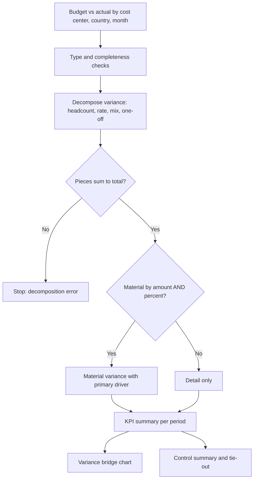

# Architecture

```mermaid
flowchart TB
 A[Budget vs actual by cost center, country, month] --> B[Type and completeness checks]
 B --> C[Decompose variance: headcount, rate, mix, one-off]
 C --> D{Pieces sum to total?}
 D -- No --> X[Stop: decomposition error]
 D -- Yes --> E{Material by amount AND percent?}
 E -- Yes --> F[Material variance with primary driver]
 E -- No --> G[Detail only]
 F --> H[KPI summary per period]
 G --> H
 H --> I[Variance bridge chart]
 H --> J[Control summary and tie-out]
```
