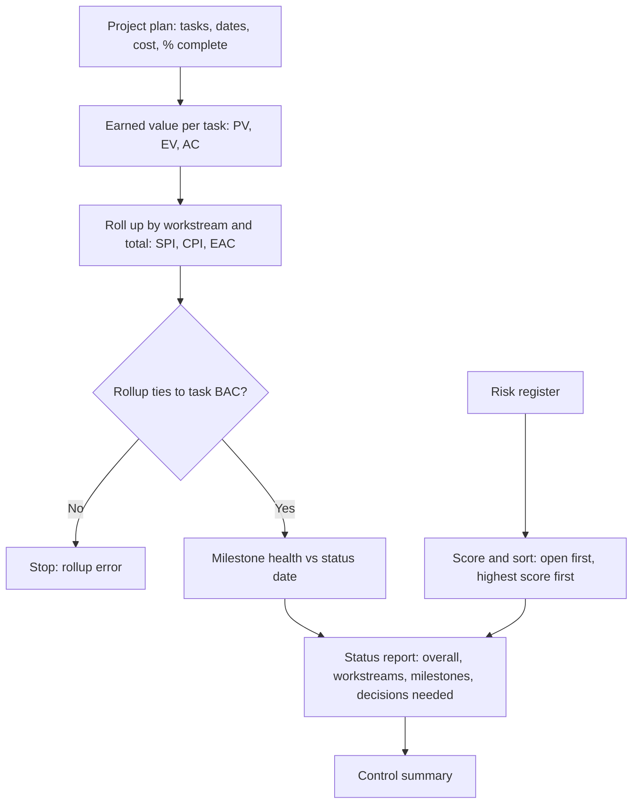

# Close Improvement Project Tracker

Earned value, milestone health and a scored risk register for a synthetic close improvement project (accrual redesign, reconciliation automation, close dashboard). The status report is generated from the plan on every run.

## What this really solves

"Build is 60% done and a bit over" doesn't tell a sponsor whether the go-live date holds, whether the budget holds, or which decisions are theirs this week. A status that is calculated from the plan does.

## Business impact

The report is the same calculation every week, so two readers see the same picture. When the schedule index drops, the report says so before it comes up in a meeting. The project manager's time goes to the decisions rather than the slide.

## How it works

Each task has a planned window, a budget, an actual cost and a percent complete. Planned value is budget earned by the calendar as of the status date; earned value is budget earned by progress; actual cost is spend. SPI is earned over planned and CPI is earned over actual, rolled up by workstream and total with an estimate at completion. Milestones are judged achieved, achieved late, missed or on track against the status date. Risks are scored probability times impact and sorted open first; the high ones form the decisions list. The markdown report is generated from all of it.



## Steps

1. Load the plan and the risk register.
2. Compute PV, EV, AC, SV, CV, SPI and CPI per task, with a RAG on both indices.
3. Roll up by workstream and total; compute EAC and VAC.
4. Check the rollup ties to the sum of task budgets.
5. Judge each milestone against the status date.
6. Score the risks and list the open high ones.
7. Generate the status report and the control summary.

## What the output says on this data

Status date 14 September 2026. The project is 60% earned against 74% planned: SPI 0.81 (red), CPI 0.92 (amber), estimate at completion about 107k on a 98k budget. Discovery and Design are complete and slightly over cost. Build is at 58% where 91% was planned, and both open high risks sit there. Two milestones were achieved one and two days late. The decisions for the sponsor are UAT timing and a one-person dependency on the matching logic. See [`expected-output/status_report.md`](expected-output/status_report.md).

## Vocabulary, so the report reads the same for everyone

| Term | Meaning |
|---|---|
| BAC | Budget at completion, the task or project budget |
| PV | Planned value, budget earned by the calendar |
| EV | Earned value, budget earned by progress |
| AC | Actual cost |
| SV, CV | Schedule and cost variance, EV minus PV and EV minus AC |
| SPI, CPI | EV over PV and EV over AC; 1.0 is on plan |
| EAC | Estimate at completion, BAC over CPI |
| VAC | Variance at completion, BAC minus EAC |

## Controls

- Rollup ties to the sum of task budgets, or the run stops
- RAG thresholds live in `case.json`
- Milestone state comes from dates only
- Risks scored the same way every week; the top of the list is the decisions list
- The report is generated each run, so it can't drift from the data
- Expected output regenerated and compared in CI

## Run it

```
cd case-studies/13-close-improvement-project-tracker/tracker
python project_tracker.py
python -m unittest discover -s tests -v
```

Standard library only. Dates, costs, roles and risks are invented for this repo.
