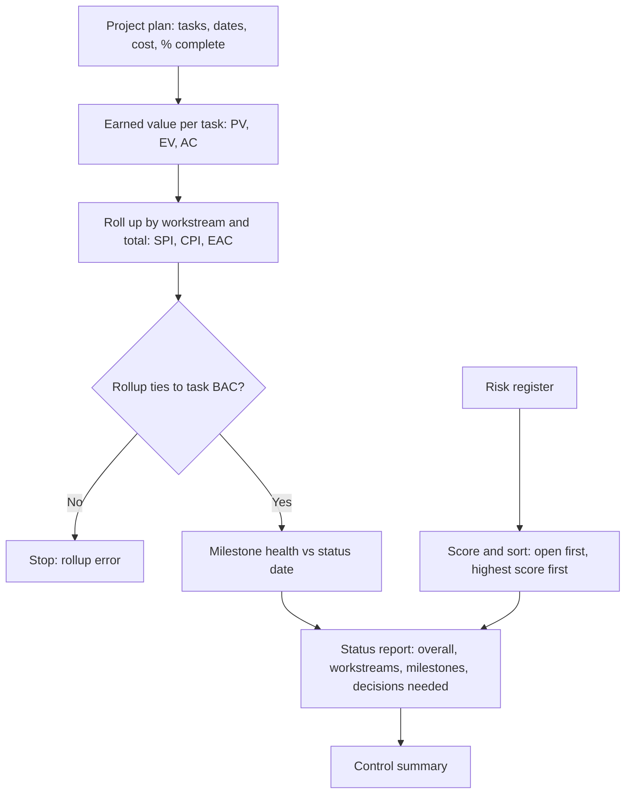

# Architecture

```mermaid
flowchart TB
 P[Project plan: tasks, dates, cost, % complete] --> EV[Earned value per task: PV, EV, AC]
 EV --> R[Roll up by workstream and total: SPI, CPI, EAC]
 R --> T{Rollup ties to task BAC?}
 T -- No --> X[Stop: rollup error]
 T -- Yes --> M[Milestone health vs status date]
 K[Risk register] --> S[Score and sort: open first, highest score first]
 M --> D[Status report: overall, workstreams, milestones, decisions needed]
 S --> D
 D --> C[Control summary]
```
