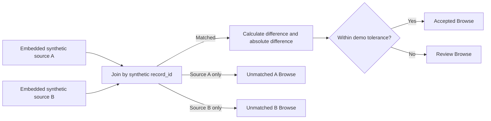

# Architecture

```mermaid
flowchart LR
    A[Embedded synthetic source A] --> J[Join by synthetic record_id]
    B[Embedded synthetic source B] --> J
    J -->|Matched| F[Calculate difference and absolute difference]
    F --> T{Within demo tolerance?}
    T -->|Yes| OK[Accepted Browse]
    T -->|No| RV[Review Browse]
    J -->|Source A only| UA[Unmatched A Browse]
    J -->|Source B only| UB[Unmatched B Browse]
```
