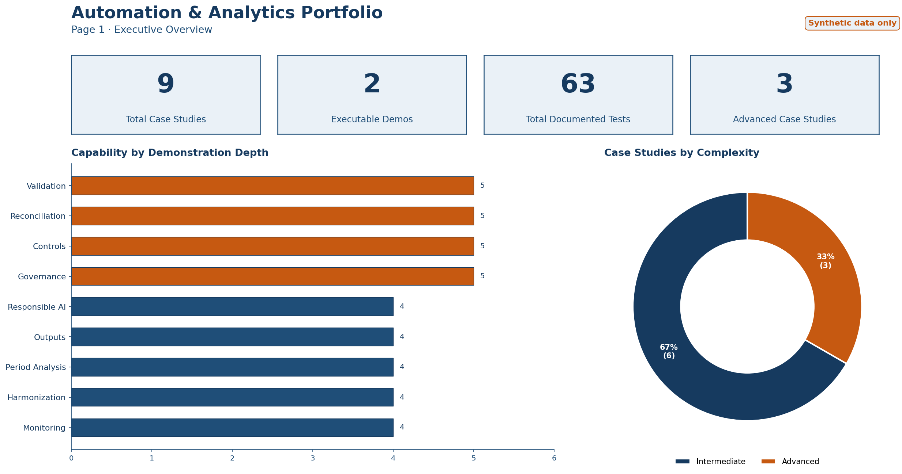
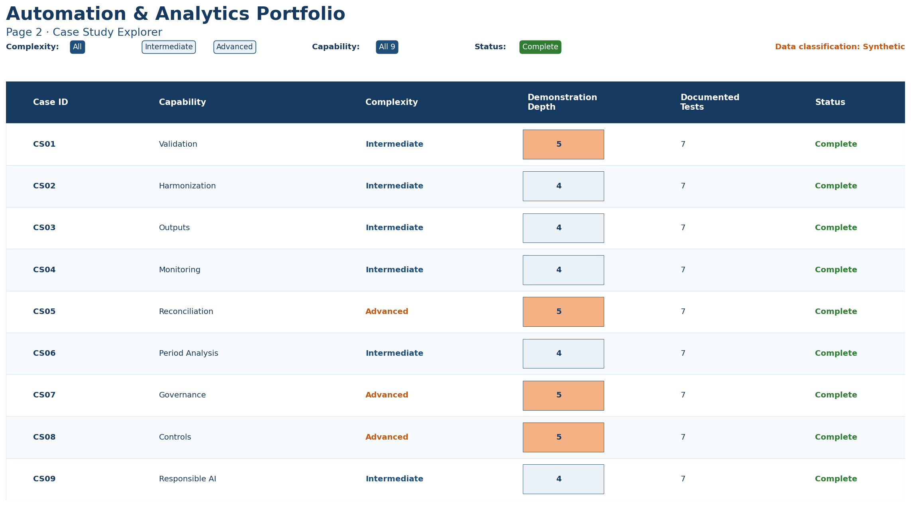
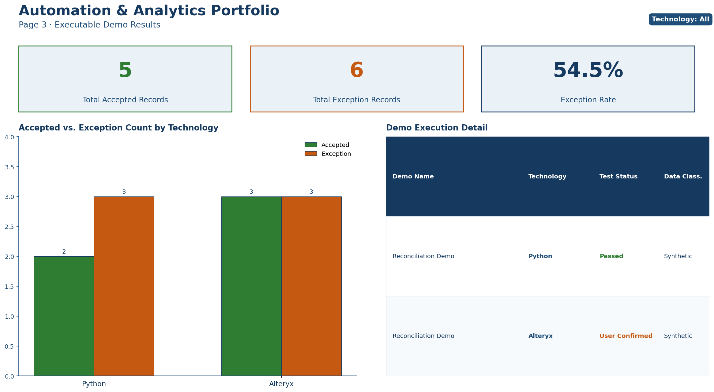

# Power BI Dashboard

A 3-page dashboard built on this portfolio's own metadata: how many case studies, what depth, and what came out of the executable demos. Same rule as everywhere else in this repo — synthetic data only, nothing traceable to an employer.

I didn't ship the `.pbix` binary. You can't diff it, and it forces whoever's reviewing this to have Power BI Desktop installed just to see it. Instead this folder has what you need to rebuild it exactly (data, DAX measures, layout spec) plus rendered screenshots below, so you can judge the actual output without opening anything.

**Executive Overview** — case counts, demo counts, test counts, and a quick read on complexity mix.

**Case Study Explorer** — all 9 cases in a matrix, with conditional formatting on demonstration depth so the advanced ones jump out.

**Executable Demo Results** — the real accepted/exception counts from the Python and Alteryx demos in this repo, broken out by technology.

## To rebuild it

1. Import `portfolio_cases.csv` and `demo_execution.csv` into Power BI Desktop.
2. Add the measures from `DAX_MEASURES.md`.
3. Lay out the three pages per `DASHBOARD_SPEC.md`.

The screenshots came straight from this spec and data, so what you build should land close to what's above.

All figures are made up to describe this portfolio itself.
